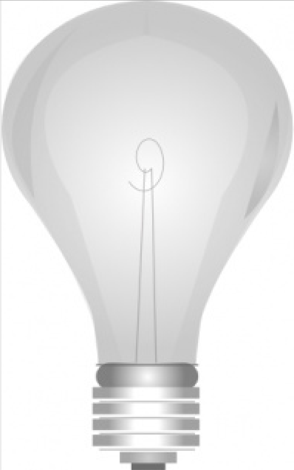

# JavaScript – DOM Light Toggle

## Hjemmeopgave

I denne hjemmeopgave arbejder du videre med **JavaScript DOM, functions og events**.

Du skal arbejde med to knapper og et billede af en pære. Når brugeren klikker på knappen **On**, skal lyset tændes, og når brugeren klikker på knappen **Off**, skal lyset slukkes.

Du arbejder selvstændigt med projektet og følger kommentarerne i filerne trin for trin.

---

# Fremgangsmåde – sådan kommer du i gang med projektet

I denne hjemmeopgave skal du bruge **GitHub Template-metoden**.

Du skal derfor **ikke downloade projektet som ZIP og ikke bruge Fork**.

Følg denne rækkefølge:

```text
GitHub Template
↓
Dit eget repository på GitHub.com
↓
GitHub Desktop
↓
Visual Studio Code
↓
Arbejd med hjemmeopgaven
↓
Commit
↓
Push
```

> Følg punkterne **ét ad gangen og i den viste rækkefølge**.

---

## 1. Opret dit eget repository på GitHub.com

Åbn det udleverede **template-repository** på GitHub.com.

Du skal være logget ind på din egen GitHub-konto.

Klik på:

**Use this template**

Vælg derefter:

**Create a new repository**

Vælg din egen GitHub-konto som ejer, og brug det repository-navn, som din underviser har angivet.

Klik derefter på:

**Create repository**

Vent et øjeblik, mens GitHub opretter dit nye repository.

### Kontrollér, at du er i dit eget repository

Når repositoryet er oprettet, skal du kontrollere navnet øverst på siden.

Det skal være **dit eget GitHub-brugernavn**, der står foran repositoryets navn.

Det kan fx se sådan ud:

```text
dit-brugernavn/js-dom-light-toggle
```

> **Stop her og kontrollér dette, før du går videre.**

---

## 2. Hent dit repository ned på din computer

Nu ligger projektet på **GitHub.com**, men du skal også have det ned på din egen computer.

Åbn **GitHub Desktop**.

Vælg:

**File → Clone repository...**

Vælg fanebladet **GitHub.com**, og find det repository, du netop har oprettet.

Hvis repositoryet ikke vises, kan du i stedet vælge fanebladet **URL** og indsætte adressen til dit repository fra GitHub.com.

### Vælg, hvor projektet skal gemmes

I feltet **Local path** vælger du, hvor projektet skal ligge på din computer.

> **Local path** betyder den mappe på din computer, hvor projektets filer bliver gemt.

Klik derefter på:

**Clone**

Vent, mens GitHub Desktop henter projektet ned på din computer.

---

## 3. Åbn projektet i Visual Studio Code

Når projektet er klonet, vælg:

**Open in Visual Studio Code**

Du skal arbejde direkte i den projektmappe, som GitHub Desktop har klonet.

Kontrollér, at projektet har denne struktur:

```text
js-dom-light-toggle/
│
├── index.html
├── css/
│   └── style.css
├── img/
│   ├── off.jpg
│   └── on.jpg
├── js/
│   └── script.js
└── README.md
```

---

# Hjemmeopgaven

Du skal primært arbejde med disse filer:

- `index.html`
- `js/script.js`

Læs kommentarerne i koden grundigt, inden du begynder at skrive din løsning.

---

## 4. Forbind JavaScript-filen med HTML-filen

Åbn:

```text
index.html
```

I filen finder du denne kommentar:

```html
<!-- Link til js/script.js herunder -->
```

Din første opgave er at forbinde JavaScript-filen med HTML-dokumentet.

JavaScript-filen ligger i mappen:

```text
js/
```

og hedder:

```text
script.js
```

> **Vær opmærksom på filstien:** `script.js` ligger ikke i samme mappe som `index.html`, men i undermappen `js`.

Skriv selv det korrekte `<script>`-element på det angivne sted.

Gem derefter filen.

---

## 5. Åbn `js/script.js`

Start med at skrive:

```js
"use strict";
```

I filen er **On-knappen** allerede hentet fra DOM'en:

```js
const lightOn = document.getElementById("onBtn");
```

Det betyder, at JavaScript nu har adgang til HTML-elementet med:

```html
id="onBtn"
```

---

## 6. Hent Off-knappen fra DOM'en

I `index.html` findes knappen:

```html
<button class="btn off-button" id="offBtn">Off</button>
```

Din opgave er at hente knappen i `script.js` med:

```text
document.getElementById()
```

Variablen skal hedde:

```js
lightOff
```

> Brug eksemplet med `lightOn` som inspiration, men skriv selv koden.

---

## 7. Hent billedet af pæren fra DOM'en

I `index.html` findes billedet:

```html

```

Du skal hente billedet fra DOM'en ved hjælp af dets `id`.

Variablen skal hedde:

```js
bulb
```

Når du har gjort det, kan JavaScript ændre billedets `src` og dermed skifte mellem den slukkede og den tændte pære.

---

## 8. Forstå funktionen `onBulb()`

Funktionen, der tænder lyset, er allerede skrevet:

```js
function onBulb() {
  bulb.src = "img/on.jpg";
}
```

Funktionen ændrer billedets `src`, så browseren viser billedet:

```text
img/on.jpg
```

> Her manipulerer du DOM'en ved at ændre en egenskab på et HTML-element via JavaScript.

---

## 9. Skriv funktionen `offBulb()`

Du skal selv skrive en funktion med navnet:

```js
offBulb()
```

Funktionen skal slukke lyset ved at ændre billedets `src` til:

```text
img/off.jpg
```

Brug funktionen `onBulb()` som inspiration, men skriv selv koden.

---

## 10. Tilføj event listener til Off-knappen

Event listeneren til **On-knappen** er allerede skrevet:

```js
lightOn.addEventListener("click", onBulb);
```

Det betyder, at funktionen `onBulb()` bliver kørt, når brugeren klikker på **On**.

Du skal selv skrive den tilsvarende kode til **Off-knappen**.

Når brugeren klikker på `lightOff`, skal funktionen:

```js
offBulb
```

køres.

---

## 11. Test løsningen i browseren

Åbn `index.html` med **Live Server**.

Klik derefter på knapperne og kontrollér:

- at **On** viser den tændte pære
- at **Off** viser den slukkede pære
- at du kan skifte frem og tilbage mellem de to billeder

Hvis noget ikke virker:

1. Åbn browserens Developer Tools.
2. Gå til **Console** og læs eventuelle fejlmeddelelser.
3. Kontrollér, at `lightOff` er skrevet korrekt.
4. Kontrollér, at `bulb` er hentet korrekt fra DOM'en.
5. Kontrollér funktionen `offBulb()`.
6. Kontrollér stierne til `img/on.jpg` og `img/off.jpg`.
7. Kontrollér din `addEventListener()` til Off-knappen.
8. Gem filerne og test igen.

---

## 12. Arbejd progressivt med commits

Du skal ikke vente med at committe, til hele hjemmeopgaven er færdig.

Lav commits løbende, når du har afsluttet en tydelig del af arbejdet.

Du kan eksempelvis lave commits efter:

```text
Forbundet JavaScript med index.html
```

```text
Tilføjet use strict
```

```text
Hentet Off-knappen og pæren fra DOM'en
```

```text
Tilføjet offBulb-funktionen
```

```text
Tilføjet event listener til Off-knappen
```

```text
Testet light toggle
```

Skriv selv korte og meningsfulde commit-beskeder, der beskriver, hvad du har ændret.

> Formålet er, at din Git-historik viser, hvordan du har arbejdet med hjemmeopgaven trin for trin.

---

## 13. Push til GitHub.com

Når du har lavet et commit i GitHub Desktop, skal du huske at klikke på:

**Push origin**

På den måde bliver dine ændringer sendt fra din computer til dit repository på GitHub.com.

Gå gerne ind på GitHub.com bagefter og kontrollér, at dine seneste commits kan ses.

---

# Når hjemmeopgaven er færdig

Kontrollér følgende:

- [ ] Jeg har oprettet mit eget repository med **Use this template**
- [ ] Jeg arbejder i mit eget repository
- [ ] Jeg har klonet projektet med GitHub Desktop
- [ ] Projektet er åbnet i Visual Studio Code
- [ ] `js/script.js` er forbundet korrekt med `index.html`
- [ ] Jeg har skrevet `"use strict";`
- [ ] Jeg har hentet Off-knappen fra DOM'en
- [ ] Variablen til Off-knappen hedder `lightOff`
- [ ] Jeg har hentet pæren fra DOM'en
- [ ] Variablen til billedet hedder `bulb`
- [ ] Jeg har skrevet funktionen `offBulb()`
- [ ] Jeg har arbejdet med billedets `src`
- [ ] Jeg har tilføjet en event listener til Off-knappen
- [ ] **On** tænder pæren
- [ ] **Off** slukker pæren
- [ ] Jeg har testet løsningen i browseren
- [ ] Jeg har lavet løbende commits
- [ ] Jeg har pushet mine commits til GitHub.com

> **Husk:** Formålet er både at træne **JavaScript DOM, functions, events og ændring af HTML-elementers egenskaber via JavaScript** og at øve workflowet mellem **GitHub.com → GitHub Desktop → Visual Studio Code → Commit → Push**.
